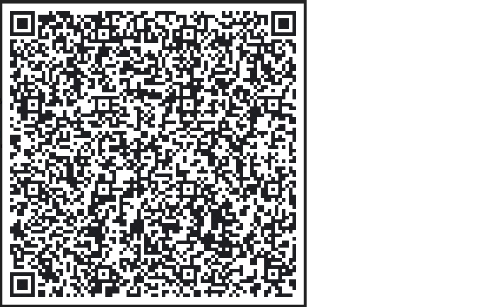

# Placa Control de Temperatura
Lectura temperatura  y  humedad.

**Esta aplicación se basa en una placa de Arduino**

* Atraves de  una aplicación de movil somos capaces de controlar los relés de salida

# Este e s el código QR de mi  aplicación

# Mira que chula queda

